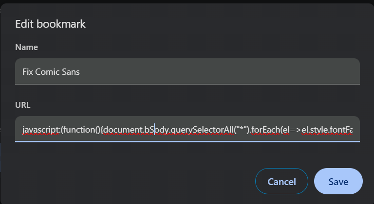
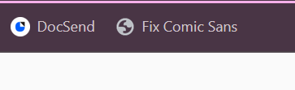

# fix-comic-sans

Chrome Bookmarklet to turn text on screen into Arial

1. Go to bookmark manager in Chrome and add a new bookmark

2. Paste the Javascript snippet into URL section

javascript:(function(){document.body.querySelectorAll("*").forEach(el=>el.style.fontFamily="Arial, sans-serif");})();

3. Click bookmark on desired webpage

Always be careful and double check the code when adding and running a Javascript snippet